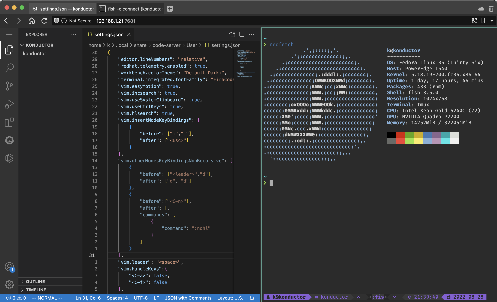

# Konductor DevOps Userspace Container

[](https://codespaces.new/ContainerCraft/konductor)

Konductor is as a multi-function operator and developer bastion.
    


## Getting Started:
- [Helm](#helm-beta)
- [Podman](#podman)
- Docker
- Docker Compose

Included:
- [Fish Shell](https://fishshell.com)
- [Starship prompt by starship.rs](https://starship.rs)
- [VS Code Server by coder.com](https://coder.com/docs/code-server/latest)
- [TTYd Terminal Server](https://github.com/tsl0922/ttyd)
- [SSH Server](https://www.ssh.com/academy/ssh/server)
- [SSH](https://www.ssh.com/academy/ssh/openssh)
- [Tmux](https://github.com/tmux/tmux/wiki/Getting-Started)
- [Tmate](https://tmate.io)
- [Helm](https://helm.sh/docs/)
- [K9s](https://k9scli.io)
- [Kubectl](https://kubernetes.io/docs/reference/kubectl/)
- [VirtCtl](https://kubevirt.io/user-guide/operations/virtctl_client_tool/)
- [Pulumi](https://www.pulumi.com/docs/get-started/)
- [Talosctl](https://www.talos.dev/v1.2/reference/cli/)
- [Jq](https://stedolan.github.io/jq/)
- [Yq](https://github.com/mikefarah/yq)

### [Helm (beta)](https://github.com/ContainerCraft/helm/tree/main/charts/konductor)

### Podman

#### Podman Play Kube:
````bash
podman play kube -f kube.yaml
````

#### Podman Run:
````bash
podman run -d --rm --pull=always --name konductor \
    --publish 2222:2222 \
    --publish 7681:7681 \
    --publish 8088:8080 \
    --publish 32767:32767 \
    --hostname konductor \
    --cap-add=CAP_AUDIT_WRITE \
    --security-opt label=disable \
  ghcr.io/containercraft/konductor
````
