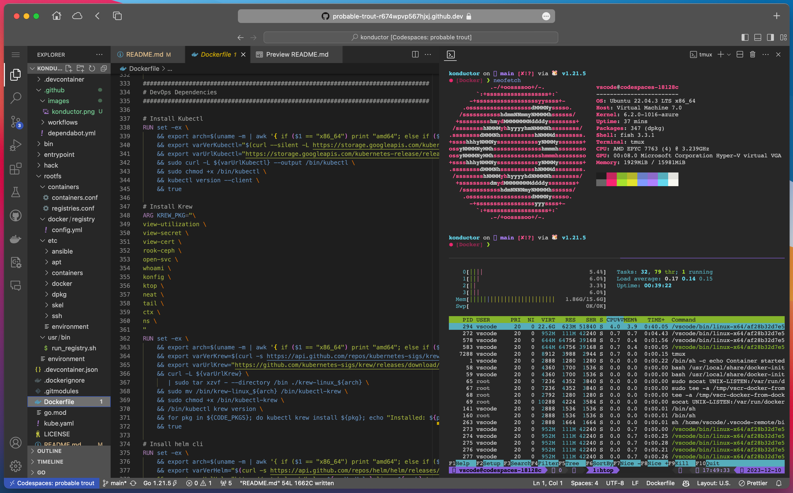

# Konductor DevOps Userspace Container

Konductor is a DevOps practitioner userspace container.

Available in two forms:

1. [Devcontainer](https://containers.dev/) for use with [VSCode](https://code.visualstudio.com/docs/devcontainers/containers) and [Codespaces](https://docs.github.com/en/codespaces/overview)
1. [VSCode Code Server](https://code.visualstudio.com/blogs/2022/07/07/vscode-server) selfhosted VSCode cloud developer IDE

## Getting Started
- [Open in GitHub Codespaces](https://codespaces.new/ContainerCraft/konductor)

## About

Included:
- [Fish Shell](https://fishshell.com)
- [Starship prompt by starship.rs](https://starship.rs)
- [VS Code Server by coder.com](https://coder.com/docs/code-server/latest)
- [TTYd Terminal Server](https://github.com/tsl0922/ttyd)
- [SSH Server](https://www.ssh.com/academy/ssh/server)
- [SSH](https://www.ssh.com/academy/ssh/openssh)
- [Tmux](https://github.com/tmux/tmux/wiki/Getting-Started)
- [Tmate](https://tmate.io)
- [Helm](https://helm.sh/docs/)
- [K9s](https://k9scli.io)
- [Kubectl](https://kubernetes.io/docs/reference/kubectl/)
- [VirtCtl](https://kubevirt.io/user-guide/operations/virtctl_client_tool/)
- [Pulumi](https://www.pulumi.com/docs/get-started/)
- [Talosctl](https://www.talos.dev/v1.2/reference/cli/)
- [Jq](https://stedolan.github.io/jq/)
- [Yq](https://github.com/mikefarah/yq)
